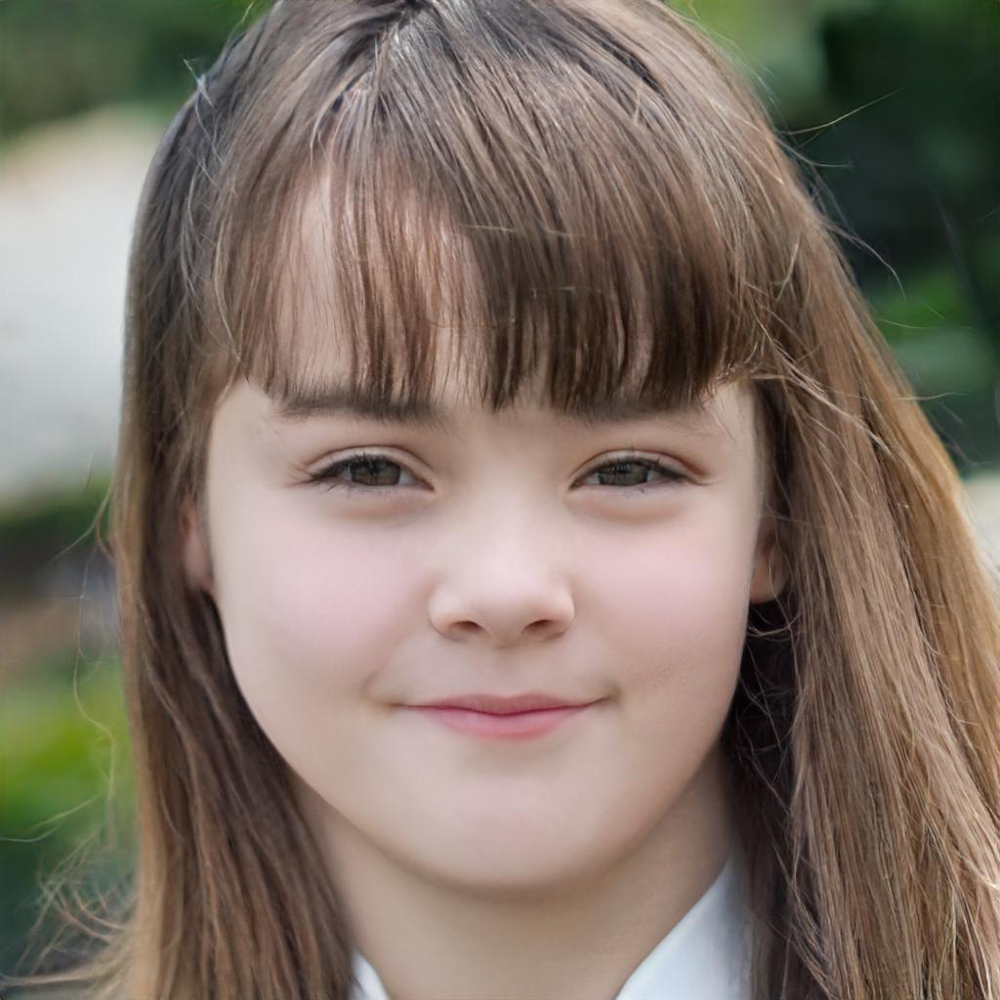

# ️🚅 🗻 ✨ n e t w o r k 2 n e t w o r k ✨ 🗻 🚅

[🅻🅸🆅🅴 🅳🅴🅼🅾](http://34.73.91.75/)

Network2network is the block explorer and avatar generator  you've been waiting for, (っ◔◡◔)っ ♥ kusama-san ♥.

`🌺 ｉｔ ｔａｋｅｓ ｄａｔａ ｆｒｏｍ ｏｎｅ ｎｅｔｗｏｒｋ ａｎｄ ｍａｐｓ ｉｔ ｔｏ ａｎｏｔｈｅｒ ｏｎｅ ， ｙａｙ 🌺`

# Address visualisation

Addresses are visualized by mapping the raw bytes of the base58 decoded address to the latent space of a GAN.

## 🌸 KUSAMA 🌸

Every kusama address is mapped to a static anime face. 

### examples

| Address | GFNxep56gqDcnTDmHfE54qCgV25MoZD2Qn7raN7TLUBobbH | EEWyMLHgwtemr48spFNnS3U2XjaYswqAYAbadx2jr9ppp4X | 1FRMM8PEiWXYax7rpS6X4XZX1aAAxSWx1CrKTyrVYhV24fg |
|-|-|-|-|
| **Image** |   |   | |

## Polkadot

Addresses in polkadot are mapped to a human face that becomes happier depending on the balance.

### examples

The following examples are for address `16fttU3nadc7KgFwxUqLyyryUiqW5VMbVMpTQ18GzNtbK9Tz`.

| Balance | 0 | 200'000 | 500'000 |
|-|-|-|-|
| **Image** |  |  | 

# Block height visualisation

The blockheight is visualised by an aging man.

| Block height | 0 | 400,000 | 1,000,000 | 
| - | - | - | - |
| **Image** |  | |   

# Tutorial 👩‍🏫
## Choose your network

The image rapresent a specific network and is mapped with the genesis hash.
Kusama it's a young and enterprising lady, she's an Anime from Fukuoka and doesnt'age.
Polkadot is a young brat, he cannot go to clubs yet and he ages depending on the block height. All the bad card Polkadot! 🙁

 

## Search for an address
On the top bar you can search for an address and visualize it

 

## Burner Wallet
The application creates a burner wallet, click on the top right icon or "My Wallet" in the start menu
 

## Last Author
You can visualize the author of the last block in the Validators section
 
 

# Attributions どうもありがとうございます！

The model used to generate the images is [StyleGAN2](https://github.com/NVlabs/stylegan2) from nvidia.

Anime model taken from [@gwern](https://twitter.com/gwern?lang=de).

Latent directions used for the FFHQ model were found and made available by [Robert Luxemburg](https://twitter.com/robertluxemburg)

